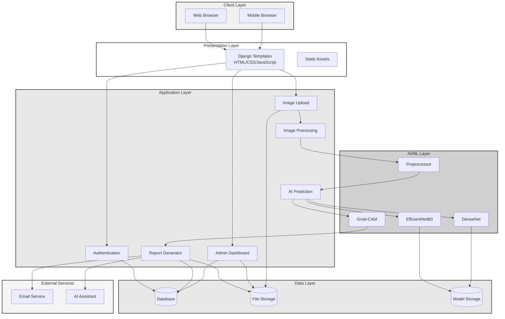
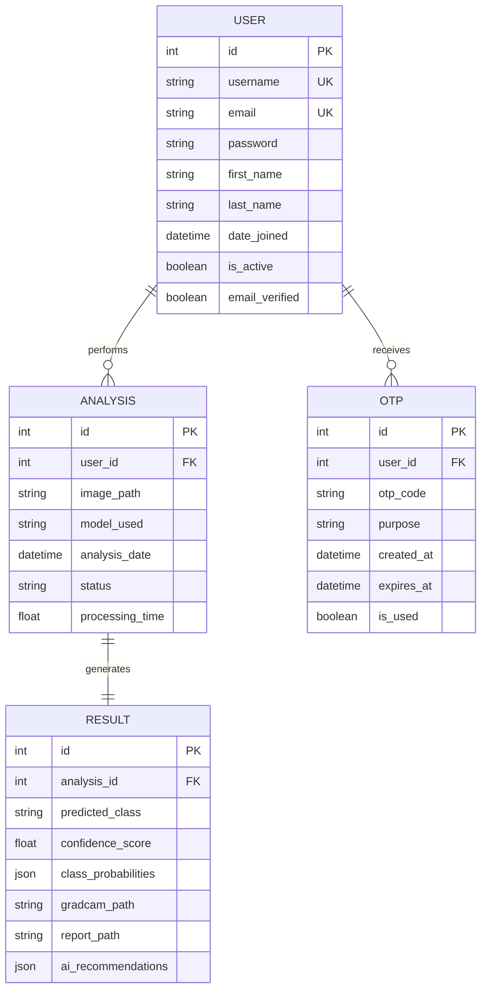
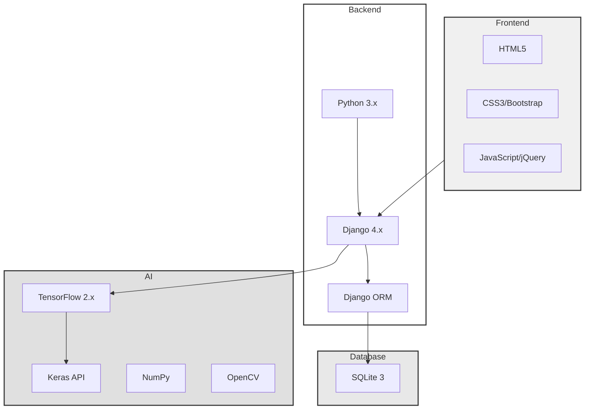

# Architecture Diagrams - Quick Copy

## High-Level System Architecture (RECOMMENDED)

---

## ER Diagram (Database Schema)

---

## Technology Stack

---

## Quick Export

1. Copy diagram code
2. Go to https://mermaid.live/
3. Export as SVG or PNG (300 DPI)
4. Insert in IEEE paper

---

## Figure Captions

**System Architecture:**
> Fig. 1. High-level system architecture showing layered structure with client, presentation, application, AI/ML, data, and external service layers.

**ER Diagram:**
> Fig. 2. Entity-Relationship diagram illustrating database schema with USER, ANALYSIS, RESULT, and OTP entities and their relationships.

**Technology Stack:**
> Fig. 3. Technology stack architecture showing frontend, backend, AI/ML, and database technologies used in the system.

---

**All diagrams use IEEE-compliant grayscale!** ✓
