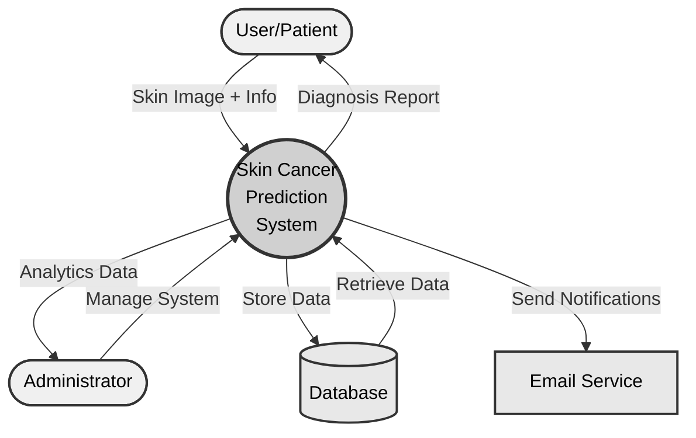
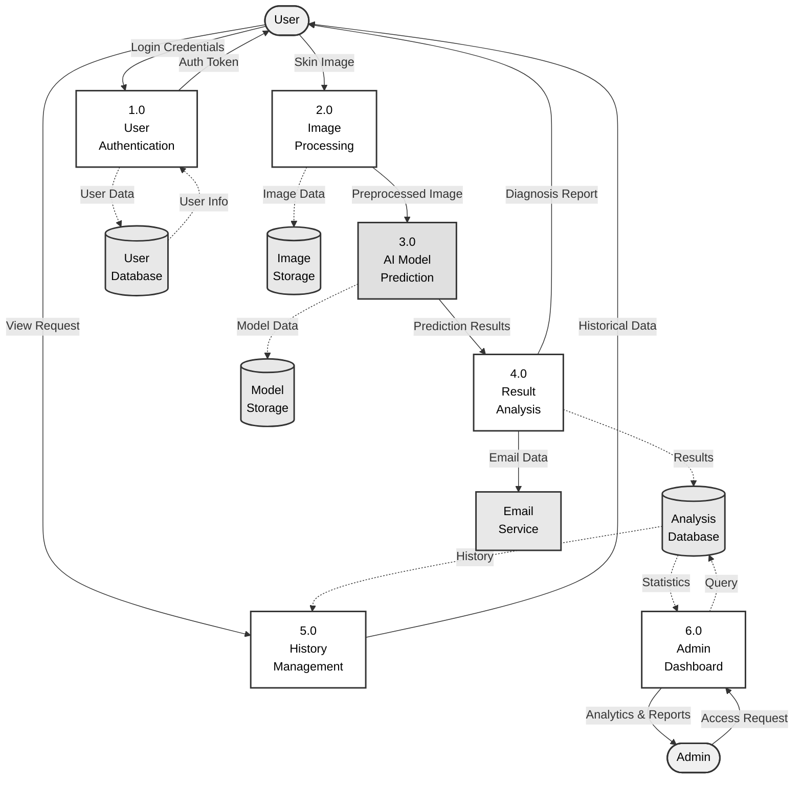
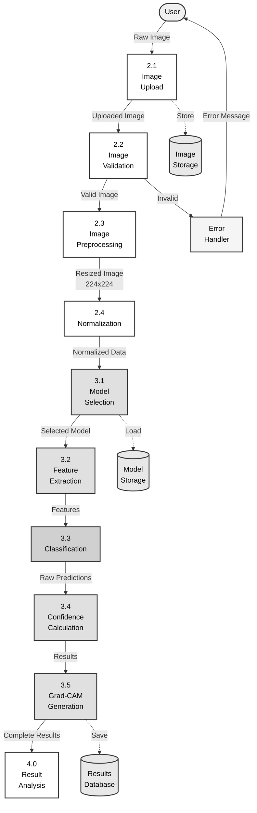
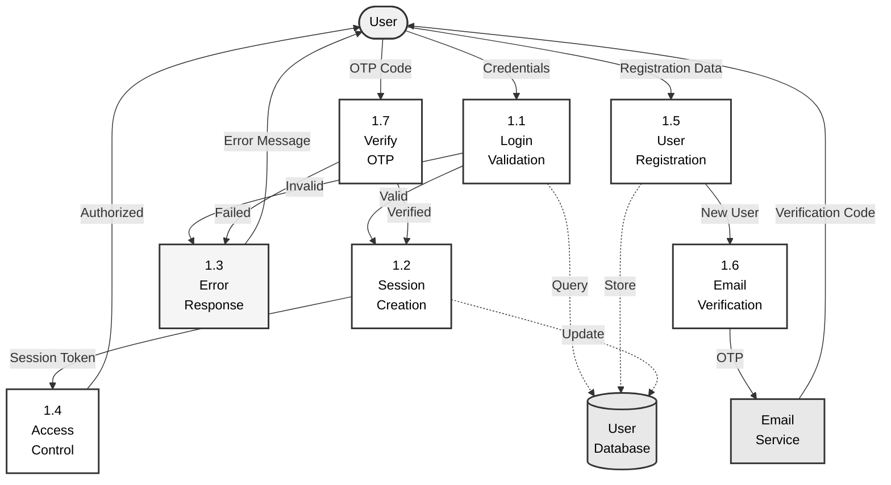
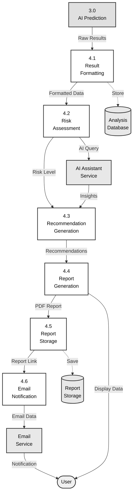
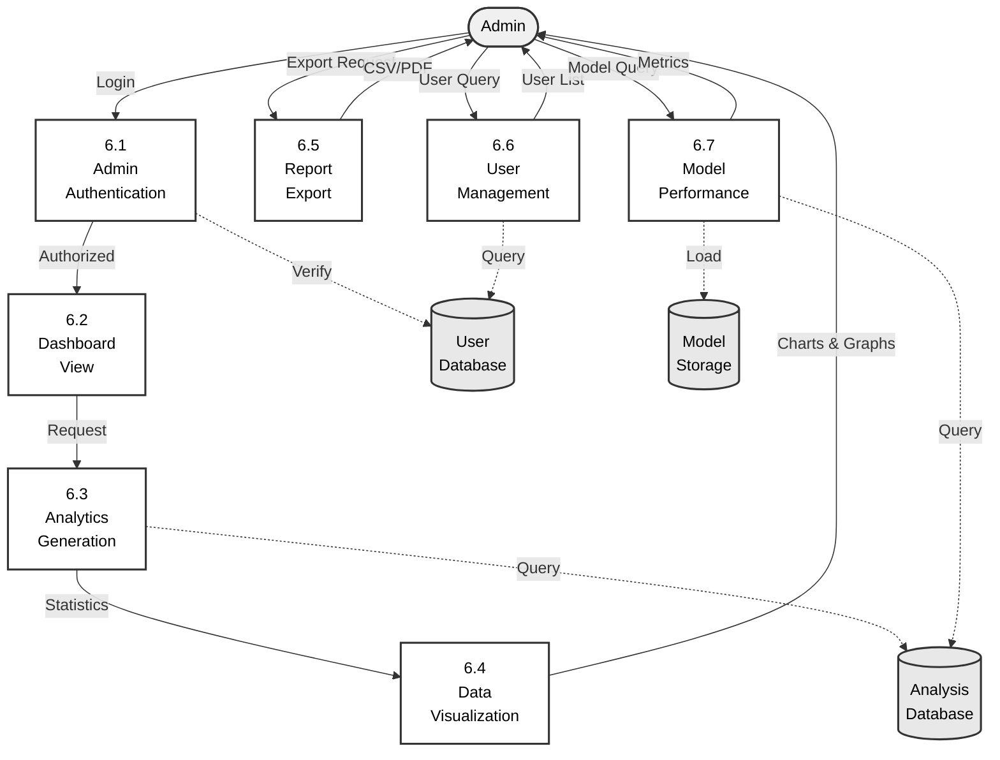

# Data Flow Diagrams (DFD) - Skin Cancer Prediction System

## Level 0: Context Diagram



**Caption:** Fig. 1. Level 0 DFD - Context diagram showing the Skin Cancer Prediction System and its external entities.

---

## Level 1: Major Processes



**Caption:** Fig. 2. Level 1 DFD - Major processes in the Skin Cancer Prediction System showing data flows between processes and data stores.

---

## Level 2: Detailed Process Breakdown

### Level 2.0 - Image Processing & Prediction (Process 2.0 & 3.0)



**Caption:** Fig. 3. Level 2 DFD - Detailed breakdown of image processing and AI prediction processes.

---

### Level 2.1 - User Authentication (Process 1.0)



**Caption:** Fig. 4. Level 2 DFD - User authentication process including registration and email verification.

---

### Level 2.2 - Result Analysis & Reporting (Process 4.0)



**Caption:** Fig. 5. Level 2 DFD - Result analysis and reporting process with AI-powered recommendations.

---

### Level 2.3 - Admin Dashboard (Process 6.0)



**Caption:** Fig. 6. Level 2 DFD - Admin dashboard processes for system management and analytics.

---

## Data Dictionary

### External Entities

| Entity | Description |
|--------|-------------|
| **User/Patient** | End user who uploads skin images for diagnosis |
| **Administrator** | System admin who manages users and monitors system |

### Processes

| Process | Name | Description |
|---------|------|-------------|
| **1.0** | User Authentication | Handles login, registration, and access control |
| **2.0** | Image Processing | Validates and preprocesses uploaded images |
| **3.0** | AI Model Prediction | Performs classification using EfficientNetB0 |
| **4.0** | Result Analysis | Analyzes predictions and generates reports |
| **5.0** | History Management | Manages user's analysis history |
| **6.0** | Admin Dashboard | Provides system analytics and management |

### Data Stores

| Store | Name | Contents |
|-------|------|----------|
| **D1** | User Database | User credentials, profiles, sessions |
| **D2** | Image Storage | Uploaded skin lesion images |
| **D3** | Model Storage | Trained AI models (EfficientNetB0, DenseNet) |
| **D4** | Analysis Database | Prediction results, history, reports |
| **D5** | Report Storage | Generated PDF reports |

### Data Flows

| Flow | Description | Data Elements |
|------|-------------|---------------|
| **Skin Image** | User uploads image | Image file, metadata |
| **Preprocessed Image** | Normalized image data | 224×224×3 tensor |
| **Prediction Results** | AI model output | Class probabilities, confidence |
| **Diagnosis Report** | Final analysis | Classification, risk, recommendations |
| **Auth Token** | Session authentication | JWT token, user ID |

---

## Usage Instructions

### Export for IEEE Paper

1. **Visit** [Mermaid Live Editor](https://mermaid.live/)
2. **Copy** any diagram code above
3. **Paste** into editor
4. **Export** as SVG (vector) or PNG (300+ DPI)
5. **Insert** into your paper

### LaTeX Example

```latex
\begin{figure}[h]
    \centering
    \includegraphics[width=0.9\textwidth]{dfd_level0.pdf}
    \caption{Level 0 DFD showing system context.}
    \label{fig:dfd0}
\end{figure}
```

---

## DFD Notation Guide

| Symbol | Meaning | Representation |
|--------|---------|----------------|
| **Circle** | Process | Transforms data |
| **Rectangle** | External Entity | Source/destination of data |
| **Parallel Lines** | Data Store | Repository of data |
| **Arrow** | Data Flow | Movement of data |
| **Dashed Arrow** | Data Store Access | Read/write operations |

---

**Color Scheme:** Professional grayscale (IEEE compliant)
- Entities: Light gray (#f0f0f0)
- Processes: White to medium gray (#ffffff - #e0e0e0)
- Data Stores: Light gray (#e8e8e8)
- AI Processes: Medium gray (#d0d0d0)

**Optimized for:** IEEE journal submission, print, digital viewing
