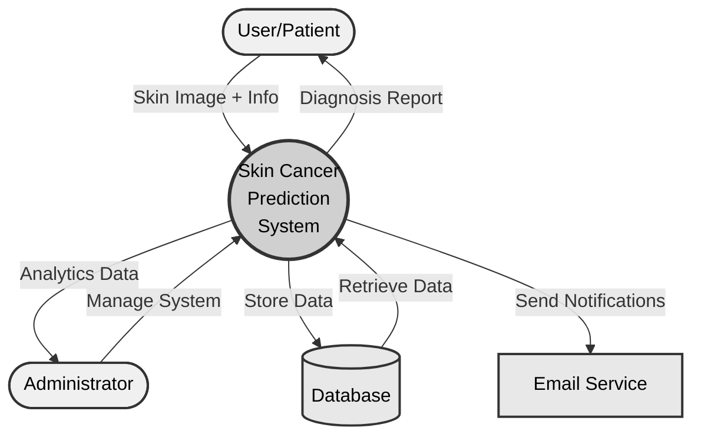
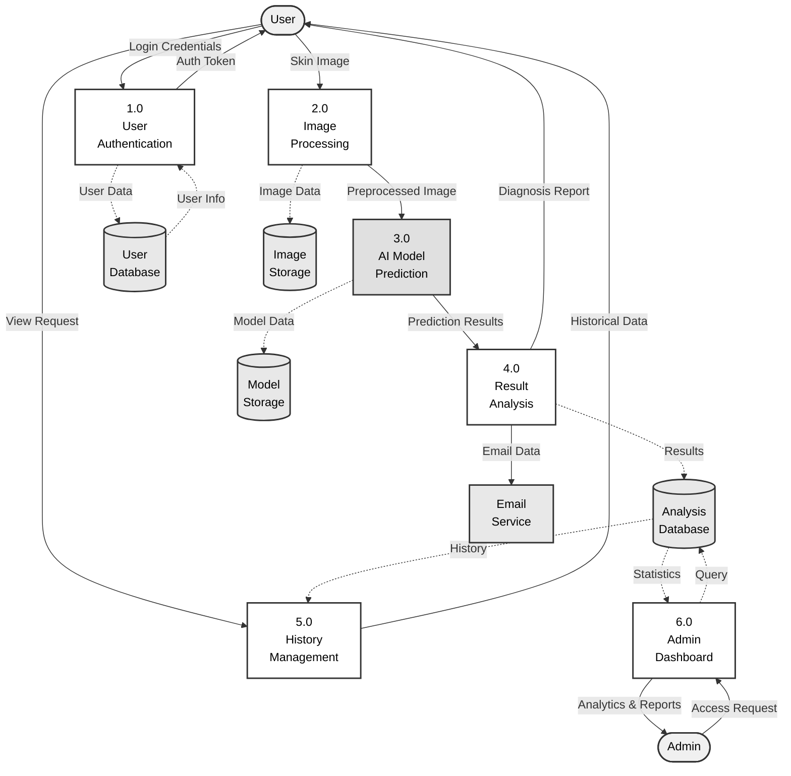

# DFD Quick Reference - Copy & Paste

## Level 0 - Context Diagram (RECOMMENDED FOR OVERVIEW)

---

## Level 1 - Major Processes

---

## Quick Export Steps

1. Copy diagram code above
2. Go to https://mermaid.live/
3. Paste code
4. Export as SVG or PNG (300 DPI)
5. Use in your IEEE paper

---

## Figure Captions (IEEE Style)

**Level 0:**
> Fig. 1. Context diagram of the Skin Cancer Prediction System showing external entities and their interactions with the system.

**Level 1:**
> Fig. 2. Level 1 DFD showing major processes including user authentication, image processing, AI prediction, result analysis, history management, and admin dashboard.

**Level 2 (Image Processing):**
> Fig. 3. Detailed DFD of image processing and AI prediction processes showing data transformation from raw image upload to final classification results.

---

## DFD Symbols

- **( )** = External Entity (User, Admin)
- **(( ))** = Main System
- **[ ]** = Process
- **[( )]** = Data Store
- **→** = Data Flow
- **-.->** = Data Store Access

---

**All diagrams use IEEE-compliant grayscale colors!** ✓
