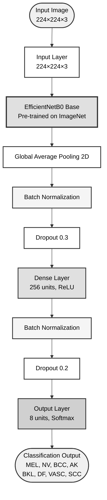
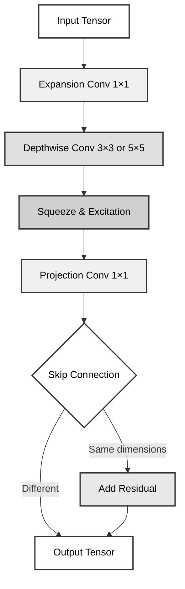
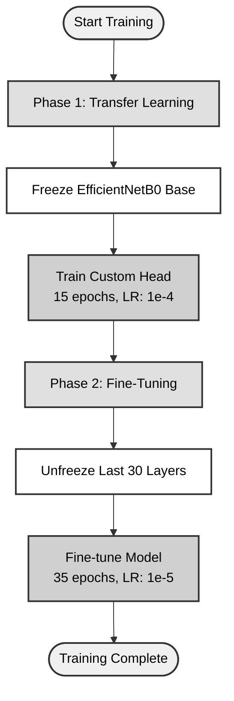
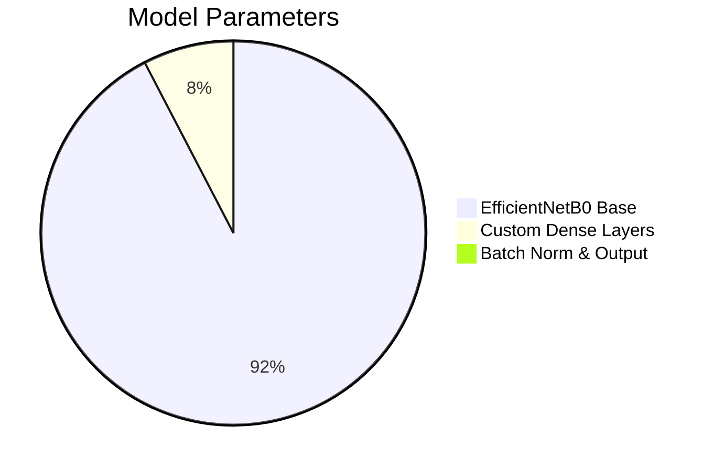

# EfficientNetB0 Architecture - IEEE Journal Format

## Main Architecture Diagram (Recommended for IEEE Paper)



---

## Detailed Architecture with EfficientNetB0 Stages

```mermaid
graph TB
    Input[Input Layer<br/>224×224×3] --> Stem[Stem Block<br/>Conv2D 3×3, 32 filters]
    
    Stem --> Stage1[Stage 1<br/>MBConv1, 16 filters]
    Stage1 --> Stage2[Stage 2<br/>MBConv6, 24 filters]
    Stage2 --> Stage3[Stage 3<br/>MBConv6, 40 filters]
    Stage3 --> Stage4[Stage 4<br/>MBConv6, 80 filters]
    Stage4 --> Stage5[Stage 5<br/>MBConv6, 112 filters]
    Stage5 --> Stage6[Stage 6<br/>MBConv6, 192 filters]
    Stage6 --> Stage7[Stage 7<br/>MBConv6, 320 filters]
    Stage7 --> Head[Head Block<br/>Conv2D 1×1, 1280 filters]
    
    Head --> GAP[Global Average Pooling]
    GAP --> BN1[Batch Normalization]
    BN1 --> Drop1[Dropout 0.3]
    Drop1 --> Dense1[Dense 256, ReLU]
    Dense1 --> BN2[Batch Normalization]
    BN2 --> Drop2[Dropout 0.2]
    Drop2 --> Output[Dense 8, Softmax]
    
    Output --> Classes[8 Classes]
    
    style Input fill:#ffffff,stroke:#333,stroke-width:2px,color:#000
    style Stem fill:#f5f5f5,stroke:#333,stroke-width:2px,color:#000
    style Stage1 fill:#e8e8e8,stroke:#333,stroke-width:2px,color:#000
    style Stage2 fill:#e8e8e8,stroke:#333,stroke-width:2px,color:#000
    style Stage3 fill:#e8e8e8,stroke:#333,stroke-width:2px,color:#000
    style Stage4 fill:#e8e8e8,stroke:#333,stroke-width:2px,color:#000
    style Stage5 fill:#e8e8e8,stroke:#333,stroke-width:2px,color:#000
    style Stage6 fill:#e8e8e8,stroke:#333,stroke-width:2px,color:#000
    style Stage7 fill:#e8e8e8,stroke:#333,stroke-width:2px,color:#000
    style Head fill:#d0d0d0,stroke:#333,stroke-width:2px,color:#000
    style GAP fill:#ffffff,stroke:#333,stroke-width:2px,color:#000
    style BN1 fill:#f5f5f5,stroke:#333,stroke-width:2px,color:#000
    style Drop1 fill:#ffffff,stroke:#333,stroke-width:2px,color:#000
    style Dense1 fill:#e0e0e0,stroke:#333,stroke-width:2px,color:#000
    style BN2 fill:#f5f5f5,stroke:#333,stroke-width:2px,color:#000
    style Drop2 fill:#ffffff,stroke:#333,stroke-width:2px,color:#000
    style Output fill:#d0d0d0,stroke:#333,stroke-width:2px,color:#000
    style Classes fill:#ffffff,stroke:#333,stroke-width:2px,color:#000
```



---

## MBConv Block Structure



---

## Training Strategy



---

## Model Parameters Distribution



---

## Usage Instructions

### For IEEE Journal Submission

1. **Recommended Diagram**: Use the "Main Architecture Diagram" at the top
2. **Export as Vector**: Use Mermaid Live Editor to export as SVG or PDF
3. **Grayscale Compatible**: All diagrams use professional grayscale colors
4. **Print-Ready**: High contrast for both digital and print

### Rendering Options

**Online (Recommended for Export):**
1. Visit [Mermaid Live Editor](https://mermaid.live/)
2. Copy diagram code
3. Export as SVG (vector) or PNG (high DPI)

**In LaTeX:**
```latex
\usepackage{graphicx}
\begin{figure}[h]
    \centering
    \includegraphics[width=0.8\textwidth]{architecture.pdf}
    \caption{EfficientNetB0 architecture for skin lesion classification.}
    \label{fig:architecture}
\end{figure}
```

**In Markdown (GitHub/GitLab):**
Simply paste the code blocks - they render automatically.

### Figure Caption Template (IEEE Style)

> Fig. 1. Proposed EfficientNetB0-based architecture for skin lesion classification. The model consists of a pre-trained EfficientNetB0 backbone followed by custom classification layers including global average pooling, batch normalization, dropout regularization, and fully connected layers, culminating in an 8-class softmax output.

---

## Color Scheme (IEEE Compliant)

**Professional Grayscale Palette:**
- **White** (#ffffff) - Input/Output layers
- **Light Gray** (#f5f5f5) - Normalization layers  
- **Medium Gray** (#e0e0e0) - Processing layers
- **Dark Gray** (#d0d0d0) - Dense/Output layers
- **Black borders** (#333) - Clear separation

**Optimized for:**
- ✓ Print publications
- ✓ Digital viewing
- ✓ Grayscale printing
- ✓ Accessibility
- ✓ IEEE standards

---

## Model Specifications

| Component | Details |
|-----------|---------|
| **Input Size** | 224×224×3 RGB |
| **Backbone** | EfficientNetB0 (ImageNet pre-trained) |
| **Total Parameters** | ~4.3M |
| **Trainable Parameters** | ~330K (custom head) |
| **Output Classes** | 8 (MEL, NV, BCC, AK, BKL, DF, VASC, SCC) |
| **Training Strategy** | Two-phase (transfer + fine-tuning) |

---

**Document Version:** 2.0 (IEEE Optimized)  
**Last Updated:** 2026-01-26  
**Suitable for:** IEEE Transactions, Conferences, Journals
