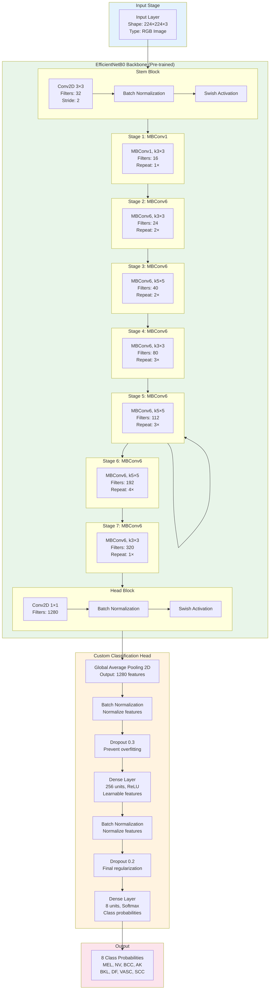
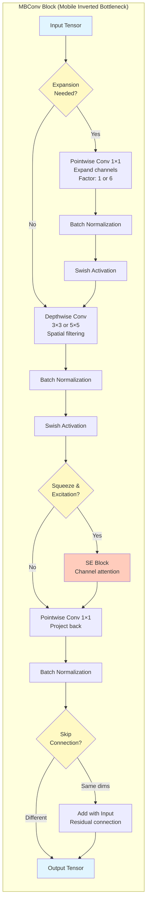
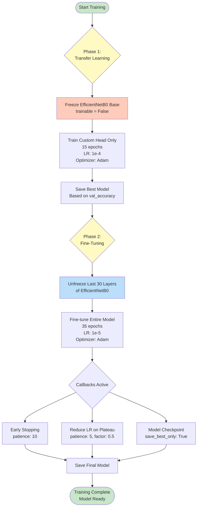
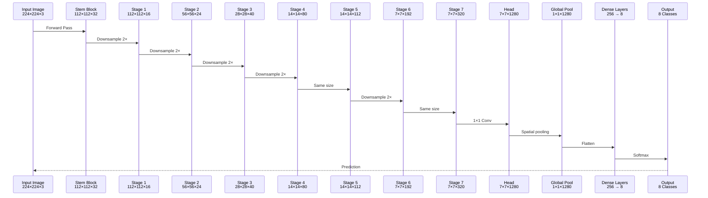
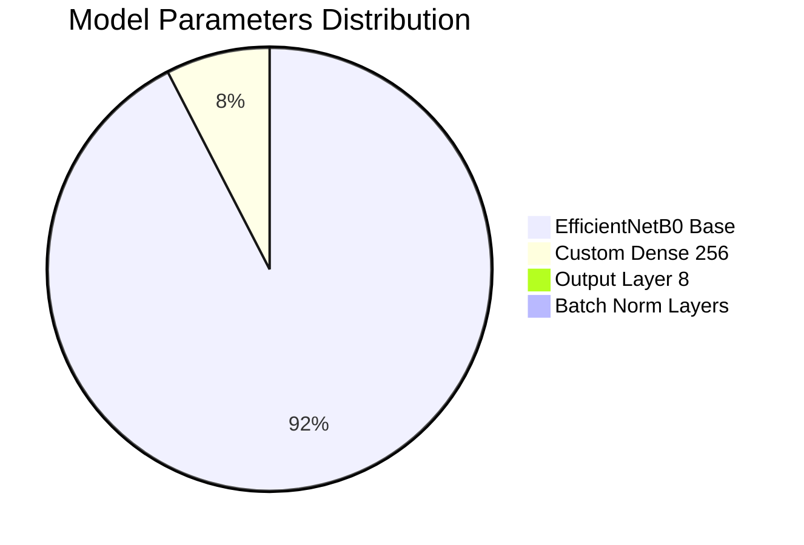
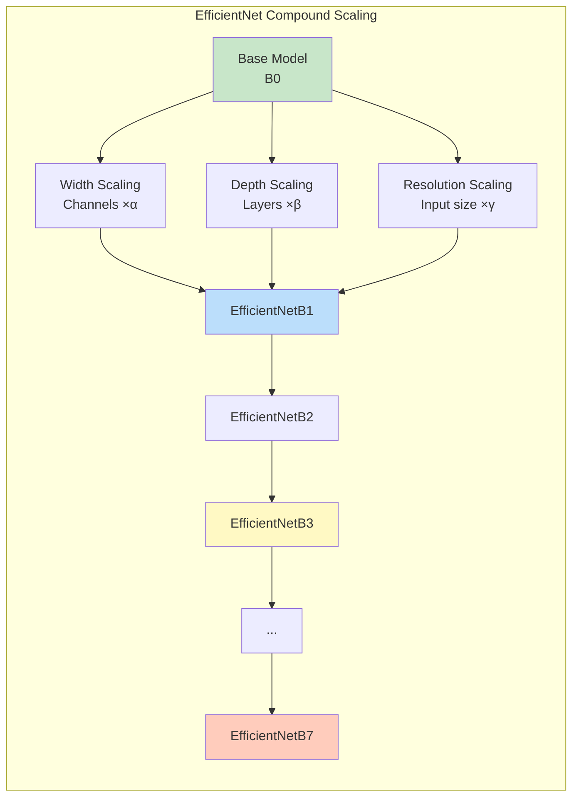

# EfficientNetB0 Architecture - Mermaid Diagrams

## Complete Architecture Flowchart

```mermaid
flowchart TD
    Start([Input Image<br/>224×224×3]) --> Input[Input Layer<br/>224×224×3]
    
    Input --> Base[EfficientNetB0 Base<br/>Pre-trained on ImageNet<br/>Frozen during initial training]
    
    Base --> Details{EfficientNetB0<br/>Internal Structure}
    
    Details --> Stem[Stem Block<br/>Conv2D + BN + Swish]
    Stem --> MB1[MBConv Blocks<br/>Stage 1-7]
    MB1 --> Head[Head Conv<br/>1×1 Conv2D]
    
    Head --> GAP[Global Average Pooling 2D<br/>Spatial Dimensions → 1×1]
    
    GAP --> BN1[Batch Normalization<br/>Normalize activations]
    
    BN1 --> Drop1[Dropout 0.3<br/>Regularization]
    
    Drop1 --> Dense1[Dense Layer<br/>256 units<br/>ReLU activation]
    
    Dense1 --> BN2[Batch Normalization<br/>Normalize activations]
    
    BN2 --> Drop2[Dropout 0.2<br/>Regularization]
    
    Drop2 --> Output[Output Layer<br/>8 units<br/>Softmax activation]
    
    Output --> Classes([8 Classes:<br/>MEL, NV, BCC, AK<br/>BKL, DF, VASC, SCC])
    
    style Start fill:#e1f5ff
    style Input fill:#bbdefb
    style Base fill:#c8e6c9
    style GAP fill:#fff9c4
    style BN1 fill:#ffccbc
    style Drop1 fill:#f5f5f5
    style Dense1 fill:#c8e6c9
    style BN2 fill:#ffccbc
    style Drop2 fill:#f5f5f5
    style Output fill:#bbdefb
    style Classes fill:#e1f5ff
    style Details fill:#ffe0b2
```



## Detailed Layer-by-Layer Architecture



## MBConv Block Detail



## Training Strategy Flowchart



## Data Flow Through Network



## Model Parameters Breakdown



## Compound Scaling (EfficientNet Concept)



## Usage Instructions

### In Markdown/Documentation
Simply copy the code blocks above and paste them into any Markdown file. They will render automatically on platforms that support Mermaid (GitHub, GitLab, Notion, etc.).

### In Jupyter Notebook
```python
from IPython.display import display, Markdown

mermaid_code = """
```mermaid
[paste mermaid code here]
```
"""

display(Markdown(mermaid_code))
```

### Online Rendering
Visit [Mermaid Live Editor](https://mermaid.live/) and paste any diagram code to render and export as PNG/SVG.

### In HTML
```html
<script src="https://cdn.jsdelivr.net/npm/mermaid/dist/mermaid.min.js"></script>
<script>mermaid.initialize({startOnLoad:true});</script>

<div class="mermaid">
[paste mermaid code here]
</div>
```

---

**Note:** All diagrams represent the EfficientNetB0 architecture as implemented in your skin lesion classification model with custom classification head.
