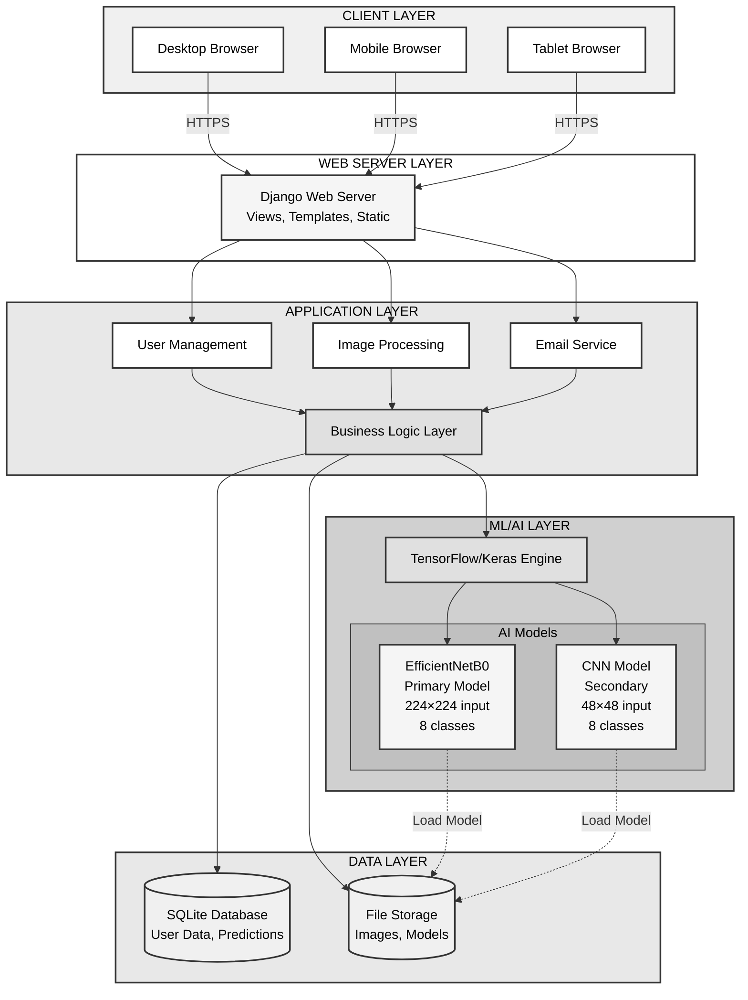
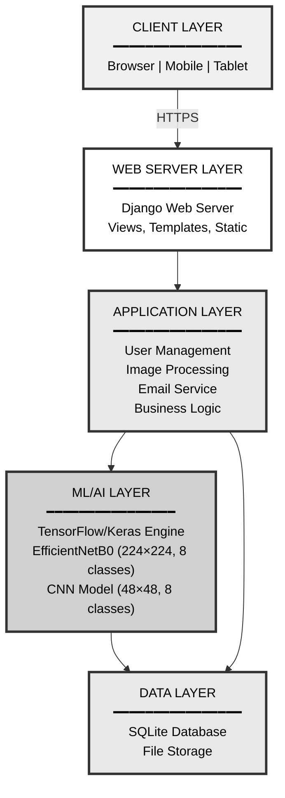
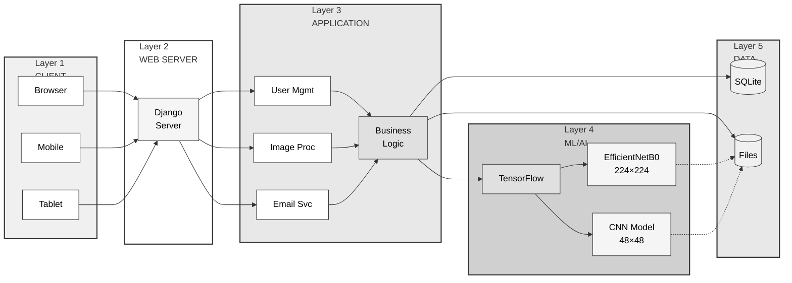
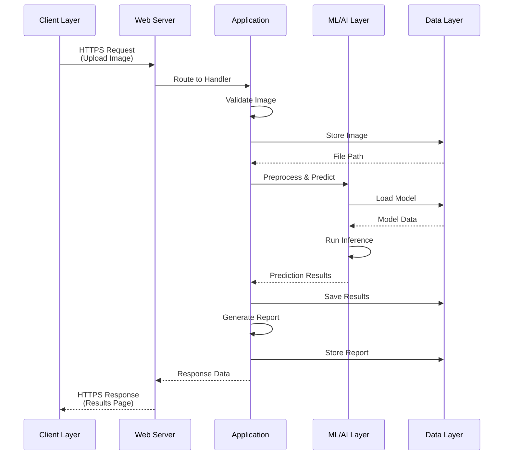

# Layered System Architecture - IEEE Format

## Complete Layered Architecture (Based on Your Design)



**Caption:** Fig. 1. Five-layer system architecture showing client, web server, application, ML/AI, and data layers with dual AI model configuration.

---

## Simplified Layered View



**Caption:** Fig. 2. Simplified five-layer architecture with clear separation of concerns.

---

## Horizontal Layer Diagram



**Caption:** Fig. 3. Horizontal view of the five-layer architecture showing component interactions.

---

## Detailed Component Breakdown

```mermaid
graph TB
    subgraph L1["LAYER 1: CLIENT"]
        direction LR
        Desktop[Desktop Browser<br/>Chrome, Firefox, Safari]
        Mobile[Mobile Browser<br/>iOS, Android]
        Tablet[Tablet Browser<br/>iPad, Android Tablet]
    end
    
    subgraph L2["LAYER 2: WEB SERVER"]
        Django[Django Web Server]
        Views[Views Controllers]
        Templates[HTML Templates]
        Static[Static Assets<br/>CSS, JS, Images]
    end
    
    subgraph L3["LAYER 3: APPLICATION"]
        Auth[User Management<br/>• Login/Register<br/>• Authentication<br/>• Authorization]
        
        ImgProc[Image Processing<br/>• Upload Handler<br/>• Validation<br/>• Preprocessing]
        
        Email[Email Service<br/>• OTP Verification<br/>• Notifications<br/>• Reports]
        
        BizLogic[Business Logic<br/>• Workflow Control<br/>• Data Validation<br/>• API Integration]
    end
    
    subgraph L4["LAYER 4: ML/AI"]
        TF[TensorFlow/Keras Engine]
        
        Model1[EfficientNetB0<br/>━━━━━━━━━━━<br/>Input: 224×224×3<br/>Output: 8 classes<br/>Primary Model]
        
        Model2[CNN Model<br/>━━━━━━━━━━━<br/>Input: 48×48×3<br/>Output: 8 classes<br/>Secondary Model]
    end
    
    subgraph L5["LAYER 5: DATA"]
        DB[(SQLite Database<br/>━━━━━━━━━━━<br/>• User Data<br/>• Predictions<br/>• Analysis History)]
        
        FS[(File Storage<br/>━━━━━━━━━━━<br/>• Uploaded Images<br/>• AI Models (.h5)<br/>• Generated Reports)]
    end
    
    Desktop --> Django
    Mobile --> Django
    Tablet --> Django
    
    Django --> Views
    Django --> Templates
    Django --> Static
    
    Views --> Auth
    Views --> ImgProc
    Views --> Email
    
    Auth --> BizLogic
    ImgProc --> BizLogic
    Email --> BizLogic
    
    BizLogic --> TF
    TF --> Model1
    TF --> Model2
    
    BizLogic --> DB
    BizLogic --> FS
    Model1 -.->|Load| FS
    Model2 -.->|Load| FS
    
    style L1 fill:#f0f0f0,stroke:#333,stroke-width:2px,color:#000
    style L2 fill:#ffffff,stroke:#333,stroke-width:2px,color:#000
    style L3 fill:#e8e8e8,stroke:#333,stroke-width:2px,color:#000
    style L4 fill:#d0d0d0,stroke:#333,stroke-width:2px,color:#000
    style L5 fill:#e8e8e8,stroke:#333,stroke-width:2px,color:#000
    
    style Desktop fill:#ffffff,stroke:#333,stroke-width:1px,color:#000
    style Mobile fill:#ffffff,stroke:#333,stroke-width:1px,color:#000
    style Tablet fill:#ffffff,stroke:#333,stroke-width:1px,color:#000
    style Django fill:#f5f5f5,stroke:#333,stroke-width:2px,color:#000
    style Views fill:#ffffff,stroke:#333,stroke-width:1px,color:#000
    style Templates fill:#ffffff,stroke:#333,stroke-width:1px,color:#000
    style Static fill:#ffffff,stroke:#333,stroke-width:1px,color:#000
    style Auth fill:#ffffff,stroke:#333,stroke-width:1px,color:#000
    style ImgProc fill:#ffffff,stroke:#333,stroke-width:1px,color:#000
    style Email fill:#ffffff,stroke:#333,stroke-width:1px,color:#000
    style BizLogic fill:#e0e0e0,stroke:#333,stroke-width:2px,color:#000
    style TF fill:#e0e0e0,stroke:#333,stroke-width:2px,color:#000
    style Model1 fill:#f5f5f5,stroke:#333,stroke-width:1px,color:#000
    style Model2 fill:#f5f5f5,stroke:#333,stroke-width:1px,color:#000
    style DB fill:#f0f0f0,stroke:#333,stroke-width:2px,color:#000
    style FS fill:#f0f0f0,stroke:#333,stroke-width:2px,color:#000
```

**Caption:** Fig. 4. Detailed component breakdown showing all modules and their interactions across five layers.

---

## Layer Responsibilities

### Layer 1: Client Layer
**Purpose:** User interface and interaction
- Desktop browsers (Chrome, Firefox, Safari)
- Mobile browsers (iOS, Android)
- Tablet browsers
- **Communication:** HTTPS to Web Server

### Layer 2: Web Server Layer
**Purpose:** Request handling and routing
- Django web framework
- View controllers
- Template rendering
- Static file serving
- **Communication:** HTTP/HTTPS

### Layer 3: Application Layer
**Purpose:** Business logic and services
- **User Management:** Authentication, authorization, session management
- **Image Processing:** Upload handling, validation, preprocessing
- **Email Service:** OTP verification, notifications, report delivery
- **Business Logic:** Workflow orchestration, data validation
- **Communication:** Internal function calls

### Layer 4: ML/AI Layer
**Purpose:** Artificial intelligence and prediction
- **TensorFlow/Keras Engine:** Model loading and inference
- **EfficientNetB0:** Primary model (224×224 input, 8 classes)
- **CNN Model:** Secondary model (48×48 input, 8 classes)
- **Communication:** Model API calls

### Layer 5: Data Layer
**Purpose:** Persistent storage
- **SQLite Database:** User data, predictions, analysis history
- **File Storage:** Images, AI models (.h5 files), reports
- **Communication:** Database queries, file I/O

---

## Data Flow Through Layers



**Caption:** Fig. 5. Sequence diagram showing data flow through all five layers during image analysis.

---

## Layer Communication Matrix

| From Layer | To Layer | Protocol | Data Type |
|------------|----------|----------|-----------|
| Client | Web Server | HTTPS | HTTP Requests |
| Web Server | Application | Function Calls | Python Objects |
| Application | ML/AI | API Calls | NumPy Arrays |
| Application | Data | SQL/File I/O | Queries/Files |
| ML/AI | Data | File I/O | Model Files |

---

## Technology Stack by Layer

| Layer | Technologies |
|-------|-------------|
| **Client** | HTML5, CSS3, JavaScript, Bootstrap |
| **Web Server** | Django 4.x, Python 3.x, Gunicorn |
| **Application** | Django ORM, Python Libraries |
| **ML/AI** | TensorFlow 2.x, Keras, NumPy, OpenCV |
| **Data** | SQLite 3, File System |

---

## Scalability Considerations

### Horizontal Scaling
- **Client Layer:** Load balancer distribution
- **Web Server:** Multiple Django instances
- **Application:** Stateless service design
- **ML/AI:** Model serving with TensorFlow Serving
- **Data:** Database replication, distributed storage

### Vertical Scaling
- Increase server resources (CPU, RAM, GPU)
- Optimize database queries
- Cache frequently accessed data
- Compress static assets

---

**All diagrams use IEEE-compliant grayscale colors for professional publication.**

**Color Scheme:**
- Client Layer: #f0f0f0 (Light gray)
- Web Server: #ffffff (White)
- Application: #e8e8e8 (Medium light gray)
- ML/AI: #d0d0d0 (Medium gray)
- Data: #e8e8e8 (Medium light gray)
