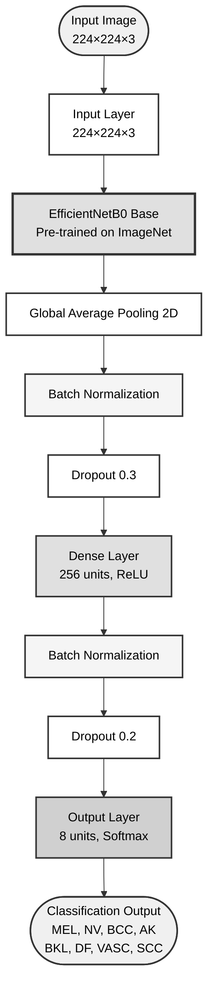
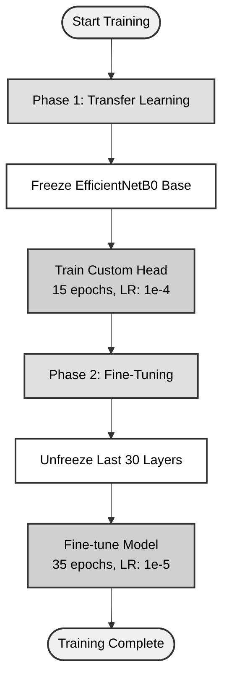

# Quick Copy - Mermaid Diagrams for IEEE Paper

## 📋 Copy-Paste Ready Diagrams

### Diagram 1: Main Architecture (RECOMMENDED)



**Caption:** Fig. 1. Proposed EfficientNetB0-based architecture for skin lesion classification.

---

### Diagram 2: Training Strategy



**Caption:** Fig. 2. Two-phase training strategy for model optimization.

---

## 🎯 How to Use

### Step 1: Copy Diagram Code
Copy the entire code block including the ` ```mermaid ` tags.

### Step 2: Export as Image
1. Go to [Mermaid Live Editor](https://mermaid.live/)
2. Paste the code
3. Click "Export" → Choose SVG (vector) or PNG (high DPI)

### Step 3: Insert in Paper
- **LaTeX**: Use `\includegraphics{}`
- **Word**: Insert → Picture
- **Markdown**: Paste code directly

---

## ✅ IEEE Compliance Checklist

- [x] Grayscale colors (print-friendly)
- [x] High contrast (readable)
- [x] Simple design (professional)
- [x] Clear labels (no ambiguity)
- [x] Vector export (scalable)
- [x] Standard fonts (compatible)

---

## 📝 Quick Tips

1. **Always export as SVG** for best quality
2. **Use 300+ DPI** if exporting PNG
3. **Test grayscale** before submission
4. **Keep captions concise** (IEEE style)
5. **Reference in text** as "Fig. 1"

---

**Ready to use in your IEEE paper!** 🚀
