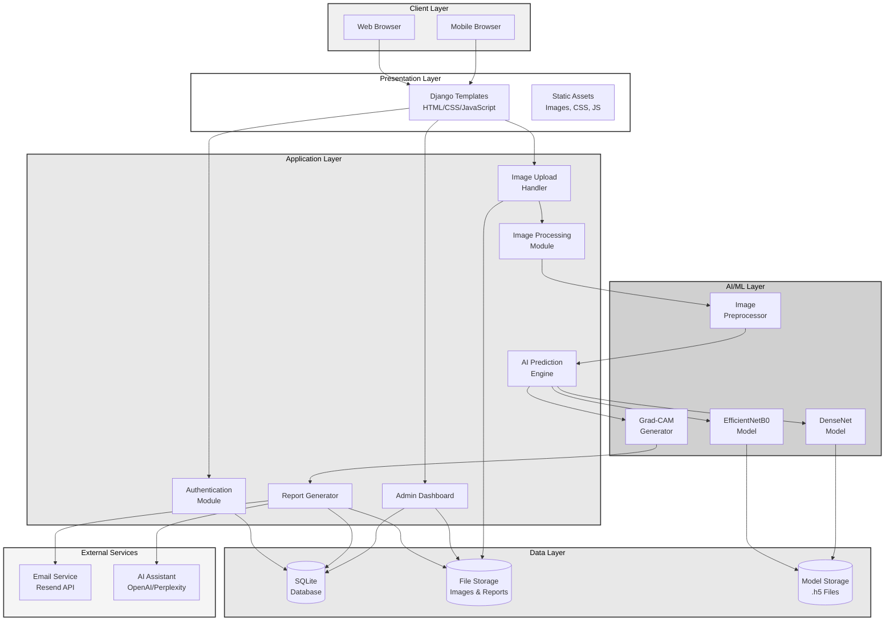
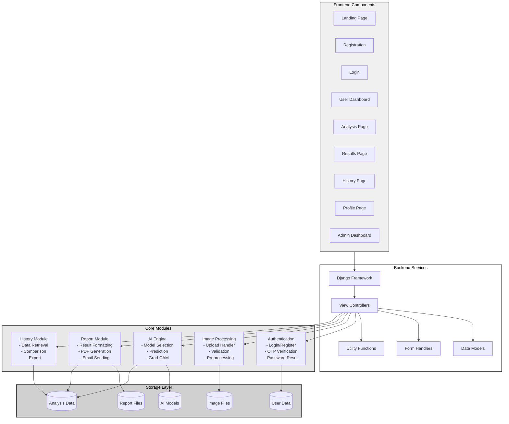
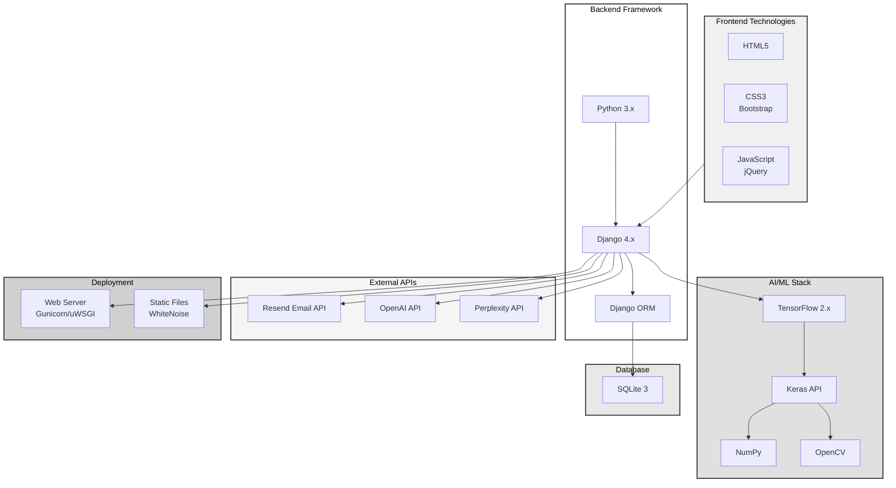
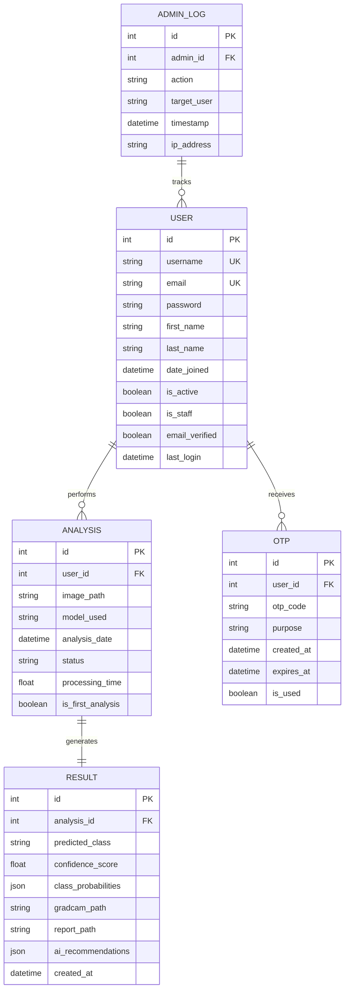
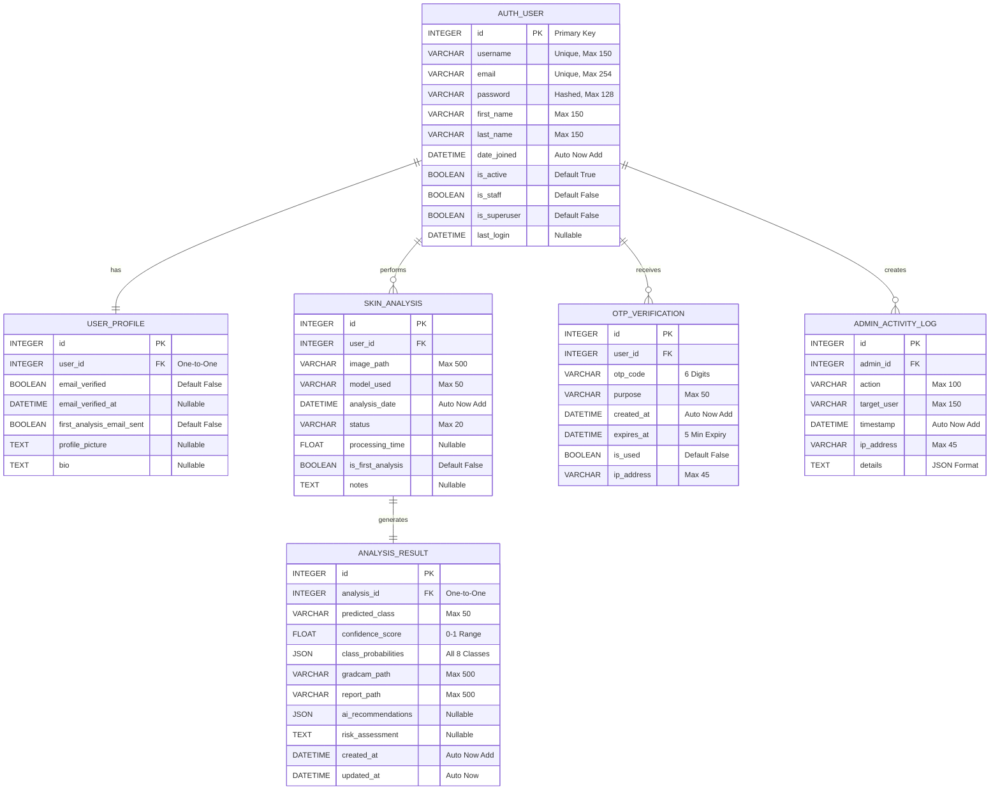
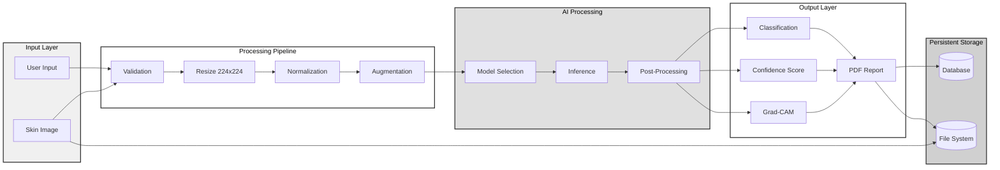
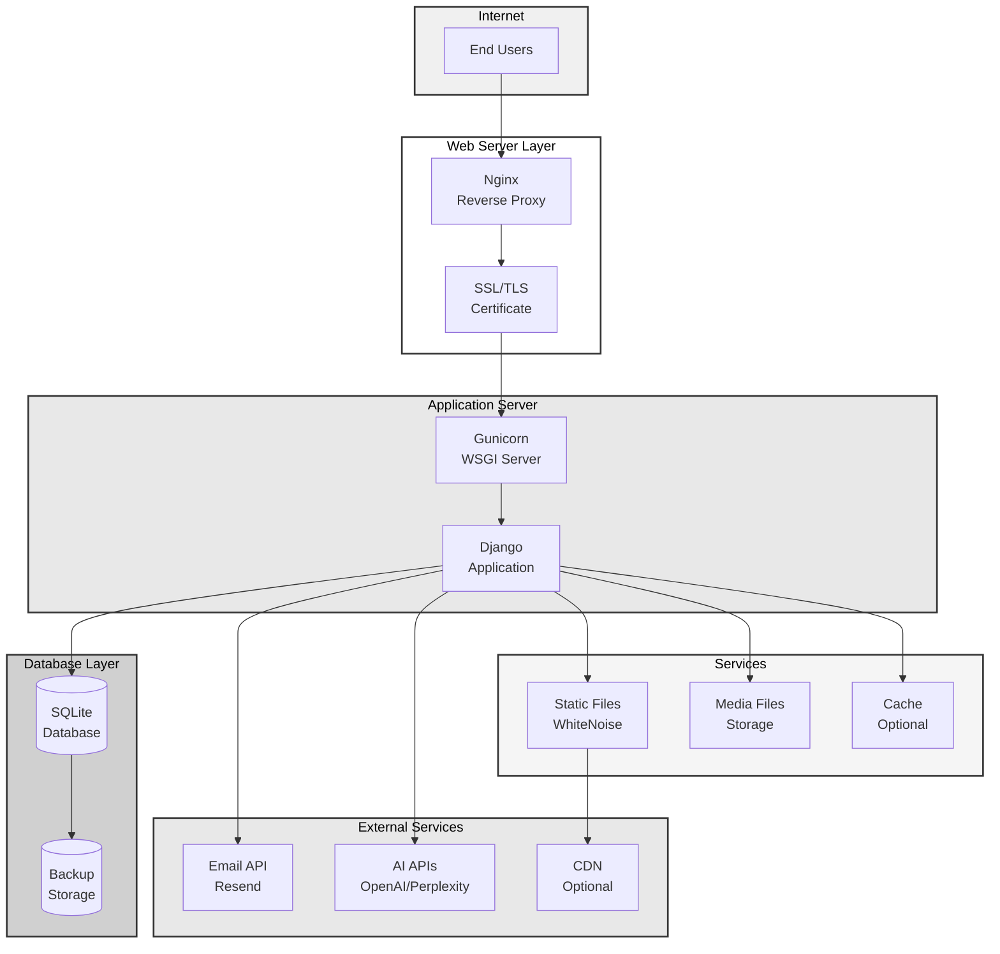
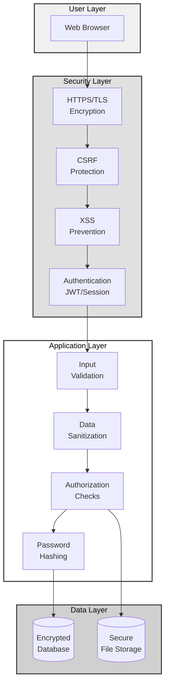

# System Architecture & Database Schema - IEEE Format

## High-Level System Architecture

**Caption:** Fig. 1. High-level system architecture showing the layered structure of the Skin Cancer Prediction System.

---

## Detailed Component Architecture

**Caption:** Fig. 2. Detailed component architecture showing frontend, backend, core modules, and storage layers.

---

## Technology Stack Architecture

**Caption:** Fig. 3. Technology stack showing frontend, backend, AI/ML, database, and deployment technologies.

---

## Entity-Relationship Diagram (ER Diagram)

**Caption:** Fig. 4. Entity-Relationship diagram showing database schema and relationships between entities.

---

## Database Schema (Detailed)

**Caption:** Fig. 5. Detailed database schema with field types, constraints, and relationships.

---

## Data Flow Architecture

**Caption:** Fig. 6. Data flow architecture showing the complete processing pipeline from input to output.

---

## Deployment Architecture

**Caption:** Fig. 7. Deployment architecture showing web server, application server, services, and external integrations.

---

## Security Architecture

**Caption:** Fig. 8. Security architecture showing multiple layers of protection including encryption, authentication, and data validation.

---

## Database Tables Summary

| Table | Purpose | Key Fields | Relationships |
|-------|---------|------------|---------------|
| **AUTH_USER** | User authentication | id, username, email, password | → USER_PROFILE, SKIN_ANALYSIS |
| **USER_PROFILE** | Extended user info | user_id, email_verified | ← AUTH_USER |
| **SKIN_ANALYSIS** | Analysis records | id, user_id, image_path, model_used | ← AUTH_USER, → ANALYSIS_RESULT |
| **ANALYSIS_RESULT** | Prediction results | analysis_id, predicted_class, confidence | ← SKIN_ANALYSIS |
| **OTP_VERIFICATION** | Email verification | user_id, otp_code, expires_at | ← AUTH_USER |
| **ADMIN_ACTIVITY_LOG** | Admin actions | admin_id, action, timestamp | ← AUTH_USER |

---

## System Specifications

### Performance Metrics
- **Response Time:** < 3 seconds for prediction
- **Concurrent Users:** Up to 100 simultaneous
- **Image Processing:** 224×224 RGB images
- **Model Inference:** ~500ms per image
- **Database:** SQLite (upgradable to PostgreSQL)

### Scalability
- **Horizontal:** Load balancer + multiple app servers
- **Vertical:** Increase server resources
- **Database:** Migration path to PostgreSQL/MySQL
- **Storage:** Cloud storage integration (S3, Azure)

### Security Features
- HTTPS/TLS encryption
- CSRF protection
- XSS prevention
- SQL injection protection
- Password hashing (PBKDF2)
- OTP-based email verification
- Session management
- Input validation

---

**All diagrams use IEEE-compliant grayscale colors for professional publication.**
